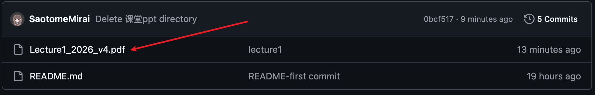
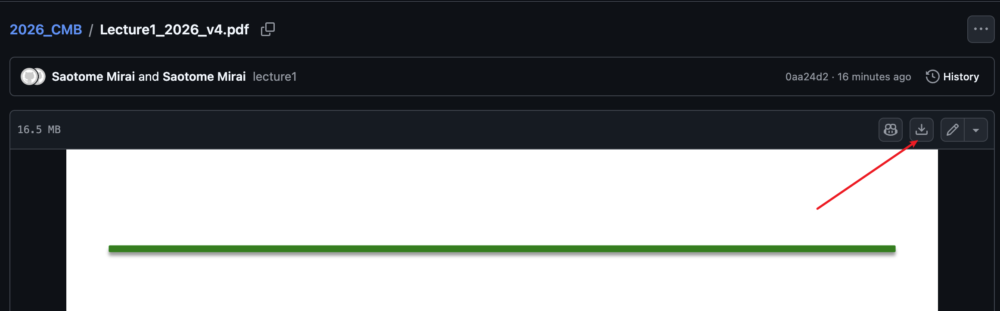
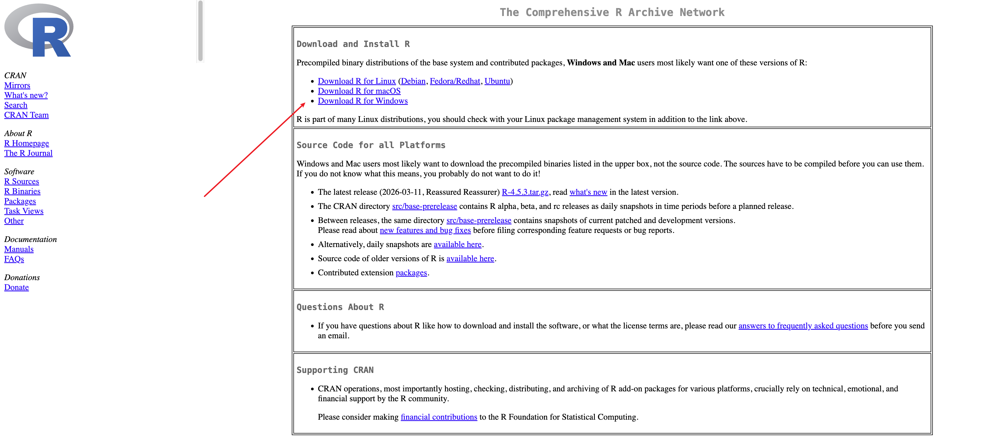
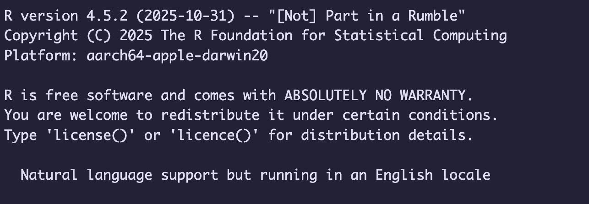

# 2026_CMB

## 课程pdf下载方式

建议使用谷歌浏览器打开，如果校园网加载较慢可以多点几次。

## Rstudio安装
### R本体的安装
1. 打开https://cran.r-project.org/mirrors.html 选择需要的中国镜像（注意Rstudio需要R3.6.0以上）
2. 选择对应系统的R本体文件，点击下载
   
### Rstudio的安装
1. 打开https://posit.co/download/rstudio-desktop/ 选择对应系统的Rstudio下载
2. 完成安装后打开Rstudio，console区显示如图字样表示安装成功
    
更详细的step-by-step教程详见B站：【R语言安装和Rstudio的安装，八分钟教会你配置全网最新R语言环境，保姆级安装教程，手把手指导】https://www.bilibili.com/video/BV14SrfBEEko?vd_source=9e23b7698b92afb02612e04ada20b10a
### Positron
如果你更适应VScode生态（习惯使用扩展等），这里推荐Positron： https://positron.posit.co/download.html ,Positron可以使用和VScode相同的方式，优雅的ssh连接服务器